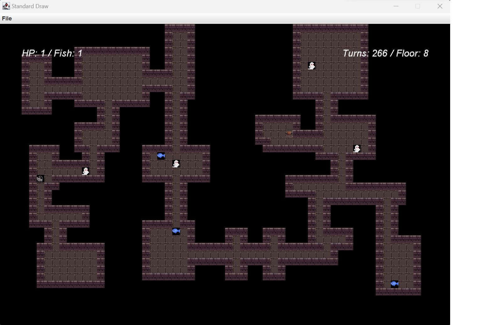

<h1 align="center"> Generative Dungeon - Meow and Boo </h1> <br>
<p align="center">
    
</p>

<!-- START doctoc generated TOC please keep comment here to allow auto update -->
<!-- DON'T EDIT THIS SECTION, INSTEAD RE-RUN doctoc TO UPDATE -->
# Table of Contents

- [About](#About)
- [Features](#features)
- [Feedback](#feedback)
- [Contributors](#contributors)
- [Build Process](#build-process)
- [Backers](#backers-)
- [Sponsors](#sponsors-)
- [Acknowledgments](#acknowledgments)

<!-- END doctoc generated TOC please keep comment here to allow auto update -->

# About

<i> Note: Generative Dungeon -- Meow and Boo is a game that I implemeted from scratch as part of UC Berkeley CS61B - Data Structure, Fall 2022, Final Project.</i> 

This Program uses random seed number passed in through command line argument by the player and randomly generates dungeon. There are two moving objects in the game; a cat and ghosts. The player`s goal is to reach the floor 10 with minimum total step across the floors, acquire as many fish and bump into ghosts as less frequent as possible.

To move up the floor, the player has to find a randomly generated staicaser and step on it, which will take the player to the next randomly generated dungeon floor. As the player moves up the floor, number of rooms, ghosts, fish in the dungeon increase linearly. As of now (<i>v1.0.0</i>), the function of each numbers are as follows;

> Number of Rooms = 10 * floor * 1 <br>
Number of Ghosts = min (floor / 2 + 1, 4)<br>
Number of Fish = min(Number of Rooms / 5, 4)<br>

The player may choose to quit the game, and start a new game or load the game. When the player loads the game, each objects in the dungeon will be where it was at the point when the player have quit the game.


# Libraries
```
edu.princeton.cs.algs4.*

java.awt.*
java.io.*
java.lang.*
java.util.*
org.junit.*
```
This projects uses StdDraw class in edu.princeton.cs library as a screen renderer. You may find the details of the StdDraw class implementation <a href = "https://introcs.cs.princeton.edu/java/stdlib/StdDraw.java.html">here</a>.


# Game Structure
Main class is the main entry point for the program, which simply parses the command line inputs, and lets the byow.Core.Engine class take over. Engine object will initiate Game object which acts as a controller for the game -- generates the dungeon, caches the dungeon to recall when the user loads the game and rendering the screen.

When generateWorld method from the Game object is called in the Engine object, generateWorld class is initiated and the map of the current floor is cached in the 2d array TETile class.

>TETile object is used to represent a single tile in the world. A 2D array of tiles make up a board, and can be drawn to the screen using the TERenderer class. TETile class can etiher be represented as a character with textcolor, and background color, or image file.

Following the world generation, game starts by calling startGame method in the Game object. When game starts, screen size is set to the given constant variable width and height (WIDTH = 60, HEIGHT = 40, at the time of this record), renders the loading screen until user input is received. User can input 'n', or 'l' or 'q'. 'n' will start a new game, 'l' will load the game when the user has quit the game after having played the game, and 'q' will quit the game.

If the user starts a new game after having played the game, this will reset the dungeon floor, number of total steps, fish obtained and load phrase as default value. Load Phrase stores all of the user`s directional inputs ('w': up, 's': down, 'a': left, 'd': right) and store it as a string value. When the user loads the game, the cached phrase is parsed to bring each objects at the place where the user has left off.

Once game is loaded, while the user has not quit the game, update the screen according to the user`s directional input. For every input, number of total steps the player has taken increased by one and load phrase is updated. Avatar object can move within the floor tile, but cannot move past the wall. The avatar can aim to move toward the staircase to climb up the floor while avoid bumping in the ghost objects. Ghost objects moves upto two step for every 2 steps(<i>v1.0.0</i>) that the avatar takes.


# Implementation

This project follows the [all-contributors](https://github.com/kentcdodds/all-contributors) specification and is brought to you by these [awesome contributors](./CONTRIBUTORS.md).

## Build Process

- Follow the [React Native Guide](https://facebook.github.io/react-native/docs/getting-started.html) for getting started building a project with native code. **A Mac is required if you wish to develop for iOS.**
- Clone or download the repo
- `yarn` to install dependencies
- `yarn run link` to link react-native dependencies
- `yarn start:ios` to start the packager and run the app in the iOS simulator (`yarn start:ios:logger` will boot the application with [redux-logger](<https://github.com/evgenyrodionov/redux-logger>))
- `yarn start:android` to start the packager and run the app in the the Android device/emulator (`yarn start:android:logger` will boot the application with [redux-logger](https://github.com/evgenyrodionov/redux-logger))

Please take a look at the [contributing guidelines](./CONTRIBUTING.md) for a detailed process on how to build your application as well as troubleshooting information.

**Development Keys**: The `CLIENT_ID` and `CLIENT_SECRET` in `api/index.js` are for development purposes and do not represent the actual application keys. Feel free to use them or use a new set of keys by creating an [OAuth application](https://github.com/settings/applications/new) of your own. Set the "Authorization callback URL" to `gitpoint://welcome`.

## Backers [](#backers)

Thank you to all our backers! 🙏 [[Become a backer](https://opencollective.com/git-point#backer)]

<a href="https://opencollective.com/git-point#backers" target="_blank"></a>

## Sponsors [](#sponsors)

Support this project by becoming a sponsor. Your logo will show up here with a link to your website. [[Become a sponsor](https://opencollective.com/git-point#sponsor)]

<a href="https://opencollective.com/git-point/sponsor/0/website" target="_blank"></a>
<a href="https://opencollective.com/git-point/sponsor/1/website" target="_blank"></a>
<a href="https://opencollective.com/git-point/sponsor/2/website" target="_blank"></a>
<a href="https://opencollective.com/git-point/sponsor/3/website" target="_blank"></a>
<a href="https://opencollective.com/git-point/sponsor/4/website" target="_blank"></a>
<a href="https://opencollective.com/git-point/sponsor/5/website" target="_blank"></a>
<a href="https://opencollective.com/git-point/sponsor/6/website" target="_blank"></a>
<a href="https://opencollective.com/git-point/sponsor/7/website" target="_blank"></a>
<a href="https://opencollective.com/git-point/sponsor/8/website" target="_blank"></a>
<a href="https://opencollective.com/git-point/sponsor/9/website" target="_blank"></a>

## Acknowledgments

Thanks to [JetBrains](https://www.jetbrains.com) for supporting us with a [free Open Source License](https://www.jetbrains.com/buy/opensource).


# Generative Dungeon - Cats and Ghosts

Generative Dungeon is a game that was implemeted from scratch as part of UC Berkeley CS61B - Data Structure, Fall 2022, Final Project. 

* **ES modules** and **tree-shaking** support.
* Add Size Limit to **Travis CI**, **Circle CI**, **GitHub Actions**
  or another CI system to know if a pull request adds a massive dependency.
* **Modular** to fit different use cases: big JS applications
  that use their own bundler or small npm libraries with many files.
* Can calculate **the time** it would take a browser
  to download and **execute** your JS. Time is a much more accurate
  and understandable metric compared to the size in bytes.
* Calculations include **all dependencies and polyfills**
  used in your JS.

<p align="center">
  
</p>

With **[GitHub action]** Size Limit will post bundle size changes as a comment
in pull request discussion.

<p align="center">

</p>

With `--why`, Size Limit can tell you *why* your library is of this size
and show the real cost of all your internal dependencies.
We are using [Statoscope] for this analysis.

<p align="center">
  
</p>

<p align="center">
  <a href="https://evilmartians.com/?utm_source=size-limit">
    
  </a>
</p>

[GitHub action]: https://github.com/andresz1/size-limit-action
[Statoscope]:    https://github.com/statoscope/statoscope
[cult-img]:      http://cultofmartians.com/assets/badges/badge.svg
[cult]:          http://cultofmartians.com/tasks/size-limit-config.html

## Who Uses Size Limit

* [MobX](https://github.com/mobxjs/mobx)
* [Material-UI](https://github.com/callemall/material-ui)
* [Autoprefixer](https://github.com/postcss/autoprefixer)
* [PostCSS](https://github.com/postcss/postcss) reduced
  [25% of the size](https://github.com/postcss/postcss/commit/150edaa42f6d7ede73d8c72be9909f0a0f87a70f).
* [Browserslist](https://github.com/browserslist/browserslist) reduced
  [25% of the size](https://github.com/browserslist/browserslist/commit/640b62fa83a20897cae75298a9f2715642531623).
* [EmojiMart](https://github.com/missive/emoji-mart) reduced
  [20% of the size](https://github.com/missive/emoji-mart/pull/111)
* [nanoid](https://github.com/ai/nanoid) reduced
  [33% of the size](https://github.com/ai/nanoid/commit/036612e7d6cc5760313a8850a2751a5e95184eab).
* [React Focus Lock](https://github.com/theKashey/react-focus-lock) reduced
  [32% of the size](https://github.com/theKashey/react-focus-lock/pull/48).
* [Logux](https://github.com/logux) reduced
  [90% of the size](https://github.com/logux/logux-client/commit/62b258e20e1818b23ae39b9c4cd49e2495781e91).


## How It Works

1. Size Limit contains a CLI tool, 3 plugins (`file`, `webpack`, `time`)
   and 3 plugin presets for popular use cases (`app`, `big-lib`, `small-lib`).
   A CLI tool finds plugins in `package.json` and loads the config.
2. If you use the `webpack` plugin, Size Limit will bundle your JS files into
   a single file. It is important to track dependencies and webpack polyfills.
   It is also useful for small libraries with many small files and without
   a bundler.
3. The `webpack` plugin creates an empty webpack project, adds your library
   and looks for the bundle size difference.
4. The `time` plugin compares the current machine performance with that of
   a low-priced Android devices to calculate the CPU throttling rate.
5. Then the `time` plugin runs headless Chrome (or desktop Chrome if it’s
   available) to track the time a browser takes to compile and execute your JS.
   Note that these measurements depend on available resources and might
   be unstable. [See here](https://github.com/mbalabash/estimo/issues/5)
   for more details.


## Usage

### JS Applications

Suitable for applications that have their own bundler and send the JS bundle
directly to a client (without publishing it to npm). Think of a user-facing app
or website, like an email client, a CRM, a landing page or a blog with
interactive elements, using React/Vue/Svelte lib or vanilla JS.

<details><summary><b>Show instructions</b></summary>

1. Install the preset:

    ```sh
    npm install --save-dev size-limit @size-limit/file
    ```

2. Add the `size-limit` section and the `size` script to your `package.json`:

    ```diff
    + "size-limit": [
    +   {
    +     "path": "dist/app-*.js"
    +   }
    + ],
      "scripts": {
        "build": "webpack ./webpack.config.js",
    +   "size": "npm run build && size-limit",
        "test": "jest && eslint ."
      }
    ```

3. Here’s how you can get the size for your current project:

    ```sh
    $ npm run size

      Package size: 30.08 kB with all dependencies, minified and gzipped
    ```

4. Now, let’s set the limit. Add 25% to the current total size and use that as
   the limit in your `package.json`:

    ```diff
      "size-limit": [
        {
    +     "limit": "35 kB",
          "path": "dist/app-*.js"
        }
      ],
    ```

5. Add the `size` script to your test suite:

    ```diff
      "scripts": {
        "build": "webpack ./webpack.config.js",
        "size": "npm run build && size-limit",
    -   "test": "jest && eslint ."
    +   "test": "jest && eslint . && npm run size"
      }
    ```

6. If you don’t have a continuous integration service running, don’t forget
   to add one — start with [Travis CI].

</details>


### JS Application and Time-based Limit

File size limit (in kB) is not the best way to describe your JS application
cost for developers. Developers will compare the size of the JS bundle
with the size of images. But browsers need much more time to parse 100 kB
of JS than 100 kB of an image since JS compilers are very complex.

This is why Size Limit support time-based limit. It runs headless Chrome
to track the time a browser takes to compile and execute your JS.

<details><summary><b>Show instructions</b></summary>

1. Install the preset:

    ```sh
    npm install --save-dev size-limit @size-limit/preset-app
    ```

2. Add the `size-limit` section and the `size` script to your `package.json`:

    ```diff
    + "size-limit": [
    +   {
    +     "path": "dist/app-*.js"
    +   }
    + ],
      "scripts": {
        "build": "webpack ./webpack.config.js",
    +   "size": "npm run build && size-limit",
        "test": "jest && eslint ."
      }
    ```

3. Here’s how you can get the size for your current project:

    ```sh
    $ npm run size

      Package size: 30.08 kB with all dependencies, minified and gzipped
      Loading time: 602 ms   on slow 3G
      Running time: 214 ms   on Snapdragon 410
      Total time:   815 ms
    ```

4. Now, let’s set the limit. Add 25% to the current total time and use that as
   the limit in your `package.json`:

    ```diff
      "size-limit": [
        {
    +     "limit": "1 s",
          "path": "dist/app-*.js"
        }
      ],
    ```

5. Add the `size` script to your test suite:

    ```diff
      "scripts": {
        "build": "webpack ./webpack.config.js",
        "size": "npm run build && size-limit",
    -   "test": "jest && eslint ."
    +   "test": "jest && eslint . && npm run size"
      }
    ```

6. If you don’t have a continuous integration service running, don’t forget
   to add one — start with [Travis CI].

</details>


### Big Libraries

JS libraries > 10 kB in size.

This preset includes headless Chrome, and will measure your lib’s execution
time. You likely don’t need this overhead for a small 2 kB lib, but for larger
ones the execution time is a more accurate and understandable metric that
the size in bytes. Libraries like [React] are good examples for this preset.

<details><summary><b>Show instructions</b></summary>

1. Install preset:

    ```sh
    npm install --save-dev size-limit @size-limit/preset-big-lib
    ```

2. Add the `size-limit` section and the `size` script to your `package.json`:

    ```diff
    + "size-limit": [
    +   {
    +     "path": "dist/react.production-*.js"
    +   }
    + ],
      "scripts": {
        "build": "webpack ./scripts/rollup/build.js",
    +   "size": "npm run build && size-limit",
        "test": "jest && eslint ."
      }
    ```

3. If you use ES modules you can test the size after tree-shaking with `import`
   option:

    ```diff
      "size-limit": [
        {
          "path": "dist/react.production-*.js",
    +     "import": "{ createComponent }"
        }
      ],
    ```

4. Here’s how you can get the size for your current project:

    ```sh
    $ npm run size

      Package size: 30.08 kB with all dependencies, minified and gzipped
      Loading time: 602 ms   on slow 3G
      Running time: 214 ms   on Snapdragon 410
      Total time:   815 ms
    ```

5. Now, let’s set the limit. Add 25% to the current total time and use that
   as the limit in your `package.json`:

    ```diff
      "size-limit": [
        {
    +     "limit": "1 s",
          "path": "dist/react.production-*.js"
        }
      ],
    ```

6. Add a `size` script to your test suite:

    ```diff
      "scripts": {
        "build": "rollup ./scripts/rollup/build.js",
        "size": "npm run build && size-limit",
    -   "test": "jest && eslint ."
    +   "test": "jest && eslint . && npm run size"
      }
    ```

7. If you don’t have a continuous integration service running, don’t forget
   to add one — start with [Travis CI].
8. Add the library size to docs, it will help users to choose your project:

    ```diff
      # Project Name

      Short project description

      * **Fast.** 10% faster than competitor.
    + * **Small.** 15 kB (minified and gzipped).
    +   [Size Limit](https://github.com/ai/size-limit) controls the size.
    ```

</details>


### Small Libraries

JS libraries < 10 kB in size.

This preset will only measure the size, without the execution time, so it’s
suitable for small libraries. If your library is larger, you likely want
the Big Libraries preset above. [Nano ID] or [Storeon] are good examples
for this preset.

<details><summary><b>Show instructions</b></summary>

1. First, install `size-limit`:

    ```sh
    npm install --save-dev size-limit @size-limit/preset-small-lib
    ```

2. Add the `size-limit` section and the `size` script to your `package.json`:

    ```diff
    + "size-limit": [
    +   {
    +     "path": "index.js"
    +   }
    + ],
      "scripts": {
    +   "size": "size-limit",
        "test": "jest && eslint ."
      }
    ```

3. Here’s how you can get the size for your current project:

    ```sh
    $ npm run size

      Package size: 177 B with all dependencies, minified and gzipped
    ```

4. If your project size starts to look bloated, run `--why` for analysis:

    ```sh
    npm run size -- --why
    ```

    > We use [Statoscope](https://github.com/statoscope/statoscope) as bundle analyzer.

5. Now, let’s set the limit. Determine the current size of your library,
   add just a little bit (a kilobyte, maybe) and use that as the limit
   in your `package.json`:

    ```diff
     "size-limit": [
        {
    +     "limit": "9 kB",
          "path": "index.js"
        }
     ],
    ```

6. Add the `size` script to your test suite:

    ```diff
      "scripts": {
        "size": "size-limit",
    -   "test": "jest && eslint ."
    +   "test": "jest && eslint . && npm run size"
      }
    ```

7. If you don’t have a continuous integration service running, don’t forget
   to add one — start with [Travis CI].
8. Add the library size to docs, it will help users to choose your project:

    ```diff
      # Project Name

      Short project description

      * **Fast.** 10% faster than competitor.
    + * **Small.** 500 bytes (minified and gzipped). No dependencies.
    +   [Size Limit](https://github.com/ai/size-limit) controls the size.
    ```

</details>


[Travis CI]: https://github.com/dwyl/learn-travis
[Storeon]: https://github.com/ai/storeon/
[Nano ID]: https://github.com/ai/nanoid/
[React]: https://github.com/facebook/react/


## Reports

Size Limit has a [GitHub action] that comments and rejects pull requests based
on Size Limit output.

1. Install and configure Size Limit as shown above.
2. Add the following action inside `.github/workflows/size-limit.yml`

```yaml
name: "size"
on:
  pull_request:
    branches:
      - master
jobs:
  size:
    runs-on: ubuntu-latest
    env:
      CI_JOB_NUMBER: 1
    steps:
      - uses: actions/checkout@v1
      - uses: andresz1/size-limit-action@v1
        with:
          github_token: ${{ secrets.GITHUB_TOKEN }}
```


## Config

### Plugins and Presets

Plugins or plugin presets will be loaded automatically from `package.json`.
For example, if you want to use `@size-limit/webpack`, you can just use
`npm install --save-dev @size-limit/webpack`, or you can use our preset
`@size-limit/preset-big-lib`.

Plugins:

* `@size-limit/file` checks the size of files with Gzip, Brotli
  or without compression.
* `@size-limit/webpack` adds your library to empty webpack project
  and prepares bundle file for `file` plugin.
* `@size-limit/webpack-why` adds reports for `webpack` plugin
  about your library is of this size to show the cost of all your
  dependencies.
* `@size-limit/webpack-css` adds css support for `webpack` plugin.
* `@size-limit/esbuild` is like `webpack` plugin, but uses `esbuild`
  to be faster and use less space in `node_modules`.
* `@size-limit/esbuild-why` add reports for `esbuild` plugin
  about your library is of this size to show the cost of all your
  dependencies.
* `@size-limit/time` uses headless Chrome to track time to execute JS.
* `@size-limit/dual-publish` compiles files to ES modules with [`dual-publish`]
  to check size after tree-shaking.

Plugin presets:

* `@size-limit/preset-app` contains `file` and `time` plugins.
* `@size-limit/preset-big-lib` contains `webpack`, `file`, and `time` plugins.
* `@size-limit/preset-small-lib` contains `esbuild` and `file` plugins.

[`dual-publish`]: https://github.com/ai/dual-publish


#### Third-Party Plugins

Third-party plugins and presets named starting with `size-limit-` are also supported.
For example:

* [`size-limit-node-esbuild`](https://github.com/un-ts/size-limit/tree/main/packages/node-esbuild)
  is like `@size-limit/esbuild` but for Node libraries.
* [`size-limit-preset-node-lib`](https://github.com/un-ts/size-limit/tree/main/packages/preset-node-lib)
  is like `@size-limit/preset-small-lib` but for Node libraries which contains
  above `node-esbuild` and core `file` plugins.


### Limits Config

Size Limits supports three ways to define limits config.

1. `size-limit` section in `package.json`:

   ```json
     "size-limit": [
       {
         "path": "index.js",
         "import": "{ createStore }",
         "limit": "500 ms"
       }
     ]
   ```

2. or a separate `.size-limit.json` config file:

   ```js
   [
     {
       "path": "index.js",
       "import": "{ createStore }",
       "limit": "500 ms"
     }
   ]
   ```

3. or a more flexible `.size-limit.js` or `.size-limit.cjs` config file:

   ```js
   module.exports = [
     {
       path: "index.js",
       import: "{ createStore }",
       limit: "500 ms"
     }
   ]
   ```

Each section in the config can have these options:

* **path**: relative paths to files. The only mandatory option.
  It could be a path `"index.js"`, a [pattern] `"dist/app-*.js"`
  or an array `["index.js", "dist/app-*.js", "!dist/app-exclude.js"]`.
* **import**: partial import to test tree-shaking. It could be `"{ lib }"`
  to test `import { lib } from 'lib'`, `*` to test all exports,
  or `{ "a.js": "{ a }", "b.js": "{ b }" }` to test multiple files.
* **limit**: size or time limit for files from the `path` option. It should be
  a string with a number and unit, separated by a space.
  Format: `100 B`, `10 kB`, `500 ms`, `1 s`.
* **name**: the name of the current section. It will only be useful
  if you have multiple sections.
* **entry**: when using a custom webpack config, a webpack entry could be given.
  It could be a string or an array of strings.
  By default, the total size of all entry points will be checked.
* **webpack**: with `false` it will disable webpack.
* **running**: with `false` it will disable calculating running time.
* **gzip**: with `false` it will disable gzip compression.
* **brotli**: with `true` it will use brotli compression and disable
  gzip compression.
* **config**: a path to a custom webpack config.
* **ignore**: an array of files and dependencies to exclude from
  the project size calculation.
* **modifyWebpackConfig**: (.size-limit.js only) function that can be used
  to do last-minute changes to the webpack config, like adding a plugin.
* **compareWith**: path to `stats.json` from another build to compare
  (when `--why` is using).
* **uiReports**: custom UI reports list (see [Statoscope docs]).

If you use Size Limit to track the size of CSS files, make sure to set
`webpack: false`. Otherwise, you will get wrong numbers, because webpack
inserts `style-loader` runtime (≈2 kB) into the bundle.

[Statoscope docs]: https://github.com/statoscope/statoscope/tree/master/packages/webpack-plugin#optionsreports-report
[pattern]: https://github.com/sindresorhus/globby#globbing-patterns

## Analyze with `--why`

You can run `size-limit --why` to analyze the bundle.

You will need to install `@size-limit/esbuild-why` or `@size-limit/webpack-why`
depends on which bundler you are using (default is `esbuild`).

For `@size-limit/esbuild-why`,
it will generate a `esbuild-why.html` at the current directory.

If you also specify `--save-bundle <DIR>`,
the report will be generated inside `<DIR>`.

If you have multiple sections in your config,
the files will be named `esbuild-why-{n}.html`,
or you can give it a custom name:

```jsonc
[
  {
    "name": "cjs",
    /* snap */
  },
  {
    "name": "esm",
    /* snap */
  }
]
```

This will produce `esbuild-why-cjs.html` and `esbuild-why-esm.html` respectively.

For `@size-limit/webpack-why`,
it will generate the report and open it in the browser automatically.

## JS API

```js
const sizeLimit = require('size-limit')
const filePlugin = require('@size-limit/file')
const webpackPlugin = require('@size-limit/webpack')

sizeLimit([filePlugin, webpackPlugin], [filePath]).then(result => {
  result //=> { size: 12480 }
})
```


