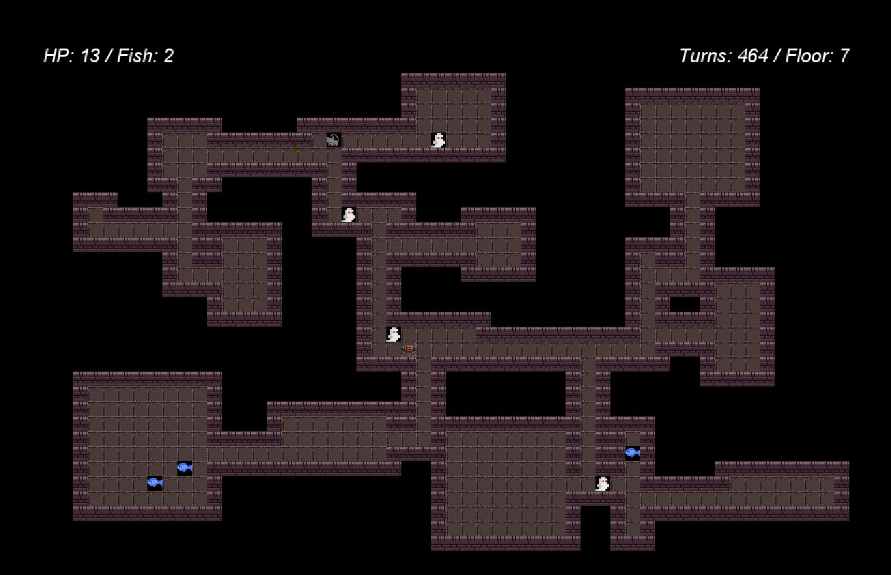
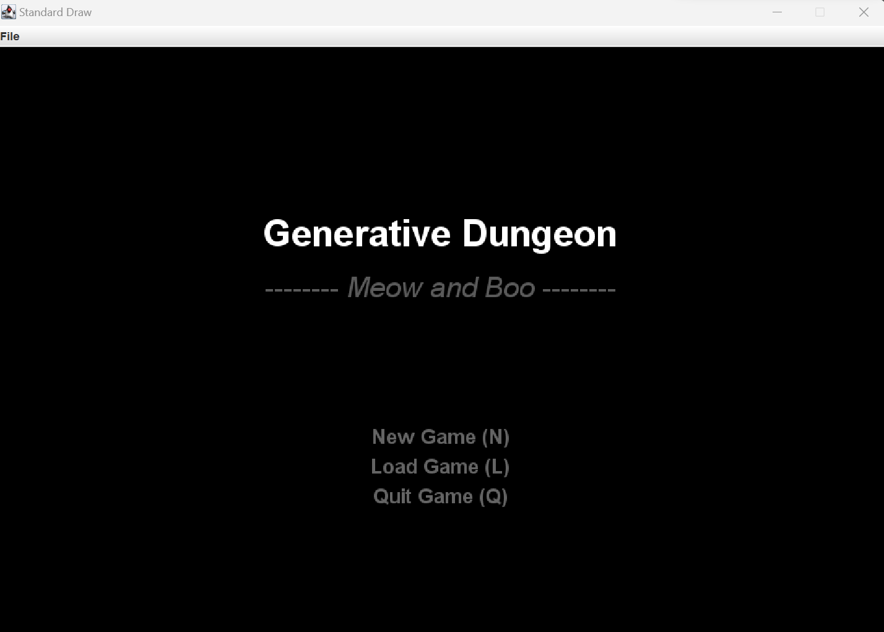
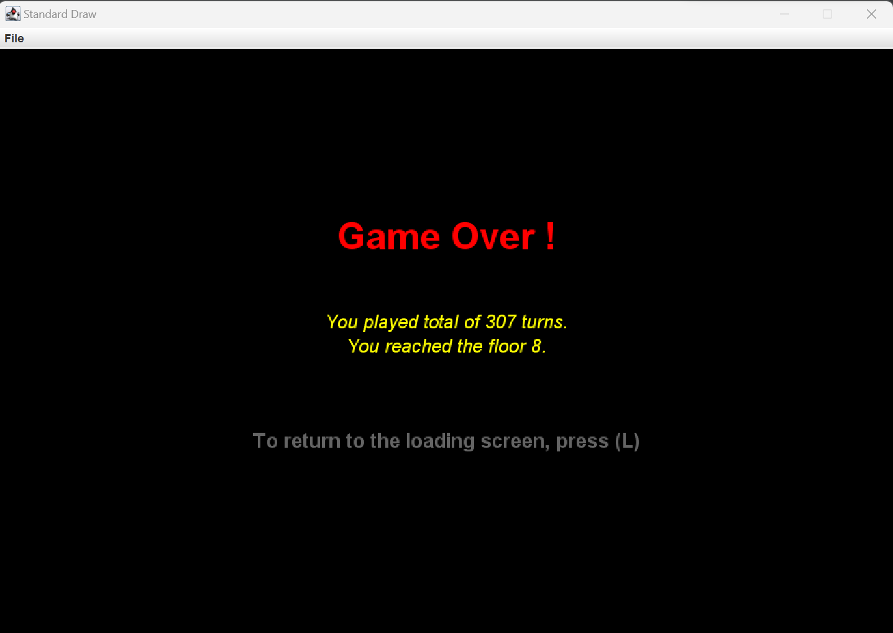
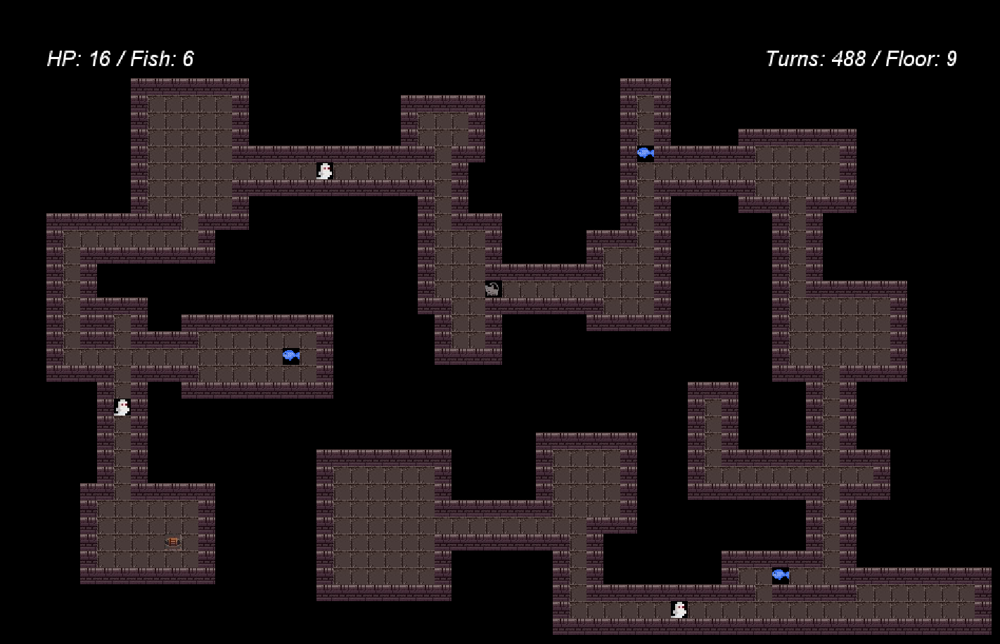

<h1 align="center"> Generative Dungeon - Meow and Boo </h1>
<p align="center">
    
    <br>
    <i>Sample Game Screen</i>
</p>

<!-- START doctoc generated TOC please keep comment here to allow auto update -->
<!-- DON'T EDIT THIS SECTION, INSTEAD RE-RUN doctoc TO UPDATE -->
# Table of Contents

- [About](#About)
- [Libraries](#Libraries)
- [Game Structure](#game-structure)
- [Implementation](#implementation)
- [More Game Screens](#more-game-screens)

<!-- END doctoc generated TOC please keep comment here to allow auto update -->

<br>

# About

<i> Note: Generative Dungeon -- Meow and Boo is a game that I implemeted from scratch as part of UC Berkeley CS61B - Data Structure, Fall 2022, Final Project.</i> 

This Program uses random seed number passed in through command line argument by the player and randomly generates dungeon. There are two moving objects in the game; a cat and ghosts. The player`s goal is to reach as highest floor as possible without being haunted by ghost! -- when your avatar bumps into the ghost, your avatar may receive damage from the ghosts.  

To move up the floor, the player has to find a randomly generated staicaser and step on it, which will take the player to the next randomly generated dungeon floor. As the player moves up the floor, number of rooms, ghosts, fish in the dungeon increase linearly. As of now (<i>v1.0.0</i>), the function of each numbers are as follows;

> Number of Rooms = 10 * floor * 1<br> Number of Ghosts = min (floor / 2 + 1, 4)<br> Number of Fish = min(Number of Rooms / 5, 4)<br>

The player may choose to quit the game, and start a new game or load the game. When the player loads the game, each objects in the dungeon will be where it was at the point when the player have quit the game.

<br>

# Libraries
```
edu.princeton.cs.algs4.*
org.junit.* 

java.awt.*
java.io.*
java.lang.*
java.util.*
```
This projects uses StdDraw class from edu.princeton.cs library as a screen renderer. You may find the details of the StdDraw class implementation <a href = "https://introcs.cs.princeton.edu/java/stdlib/StdDraw.java.html">here</a>. And you may find the required library to run the program in the library package.

<br>

# Game Structure
Main class is the main entry point for the program, which simply parses the command line inputs, and lets the byow.Core.Engine class take over. Engine object will initiate Game object which acts as a controller for the game.

When generateWorld method from the Game object is called in the Engine object, generateWorld class is initiated and the map of the current floor is cached in the 2d array TETile class.

>      TETile object is used to represent a single tile in the world. A 2D array of tiles make up a board, and can be drawn to the screen using the TERenderer class. TETile class can etiher be represented as a character with textcolor, and background color, or image file.

Following the world generation, game starts by calling startGame method in the Game object. When game starts, screen size is set to the given constant variable width and height (WIDTH = 60, HEIGHT = 40, at the time of this record), renders the loading screen until user input is received. User can input <i>'N'</i>, or <i>'L'</i> or <i>'Q'</i>. <i>'N'</i> will start a new game, <i>'l'</i> will load the game when the user has quit the game after having played the game, and <i>'Q'</i> will quit the game.

If the user starts a new game after having played the game, this will reset the dungeon floor, number of total steps, fish obtained. When the user loads the game, the cached world state will be called in the TETRenderer class.

Once game is loaded, while the user has not quit the game, the screen will be updated according to the user`s directional input. For every input, total number of turns the player has taken increases by one. Avatar object can move within the floor tile, but cannot move past the wall. The avatar can aim to move toward the staircase to climb up the floor while avoid bumping in the ghost objects. Ghost objects moves upto two step for every 2 steps(<i>v1.0.0</i>) that the avatar takes.


# Implementation

## World Generation 
World is generated by creating Rooms, a Staircase, Hallways, an Avatar, Ghosts, and fish in the order.

### Room Object
Room object uses HashMap data structure(<i>Key</i>: Position Object, <i>Value</i>: Position Object) to store x, y coordinate of the bottom left corner of the room and the top right of the room as key and value, respectively. When draw all method is called in generateWorld object, drawSingle method is called by the number of rooms times. Each drawSingle method call will check whether the randomly generated start Position(bottom left x, y coordinate of the room) and the end Position(top right x, y coordinate of the room) is valid. 

Start position is valid if the distance of each x and y coordinate between the newly generated position and the previously generated position -- which can be accessed by the roomCreated HashMap data structure -- is larger than 4. End position is created within maximum size of the room; 4(<i>v1.0.0</i>).

Once valid start position and the end position is found, draws the room by replacing the Nothing tile(black tile) with the floor tile and replacing the Nothing tile surrounding the room with the Wall tile.

>     Position Class includes x, y coordinate as instance variables and includes utility methods; midPos returns middle Position given two Position objects and minXPos takes in two Position objects and returns a Position with smaller X value.

### Staircase Object
Staircase is an object that can take the avatar up the floor in the dungeon. By stepping on the staircase, new room is generated with varied fish position and the ghosts position. Staircase is created by first finding the valid x, y coordinate in the map. A coordinate is valid if the tile on the x, y coordinate is floor tile. 

### Hallway Object
Hallway Object uses the Kruskal`s minimum spanning tree algorithm to find the edges connecting the rooms. Each room is represented by the middle position and the weights of each edge is calculated by summing the difference of x coordinate power of two and the difference of y coordinate. ArrayList of edges from KruskalMST Object is translated into the HashMap of Position on one end of the edge as a key and Position on the otherside of the edge as a value. For detailed Kruskal Algorithm implementation, check [here](#kruskals-minimum-spanning-tree-algorithm).

Horizontal Hallway is drawn if two Positions in the minimum spanning tree has the same x coordinate. If y coordinate is the same, vertical Hallway is drawn. If both are not the case, L-shaped Hallway is drawn. As a default, horizontal Hallway is drawn at the minimum y coordinate value of the two, while vertical Hallway is drawn depending on whether the two Positions are located in the 1st and 3rd quadrant or in the 2nd and 4th quadrant; if 1st and 3rd quadrant, draws on the maximum x value of the two positions, otherwise on the minimum x value of the two positions.

Wall is added on one tile above and below of the horizontal Hallway and on one tile left and right of the Hallway in case of the vertical Hallway.

### Avatar Object
Avatar object extends from the MovingObject Class. MovingObject is created randomly on the floor tile. A move for an Avatar is valid if the tile at the requested move location is a floor tile or a staircase tile. An Avatar has a bag where the obtained items are stored.

Avatar receives damage if there is a Ghost object on the tile that the Avatar moves to. The damage that the Avatar receives is randomly decided within the poisson distribution with the mean value linearly increasing from 10 to additional 2 with marginal increase in the floor that the Avatar is in.

Avatar can recover HP by eating the fish that it has acquired. The HP increases randomly within poisson distribution with the mean at 4.5. Avatar can only consume the fish when it has at least one fish in the bag. The fish that the Avatar has obtained is carried forward throughout the dungeon floors.

### Ghost Object
Ghost object extends from the MovingObject Class. A ghost is created randomly on floor tile. Number of ghosts varies by the floor as described [here](#about). An individual Ghost object moves in the shortest path to the Avatar. Shortest path is calculated by
Breath First Search. For the detailed implementation of the algorithm, check [here](#graph-algorithms).

## Graph Algorithms
### Kruskal`s Minimum Spanning Tree Algorithm
I used Priority Queue and WeightedQuickUnionUF data structure from princeton algs4 library for the algorithm. The algorthm first initiates the Priority Queue and adds all the Edges from the graph -- Edge class contains overriding compareTo method that compares the weight of the edge when sorting. Edge with the smallest weight is added to the WeightedQuickUnionUf data structure until either the priority queue is empty or the size of the ArrayList that stores the edges of the minimum spanning tree becomes number of vertex - 1. If adding an edge to the WeightedQuickUnionUF makes the Minimum Spanning Tree connected, that edge is not added to the Minnimum Spanning Tree. 

### Breath First Search - Shortest Path Algorithm
This algorithm finds the shortest path from a Ghost to the Avatar by using Queue data strucutre to conduct breath first search on the tiles that can be visited. Tiles can be visited if the tile is not a Nothing tile or a Wall tile or a Stairs tile or a Ghost tile and have not been visited. Initializing a getShortestPath object will create a 2D array of tiles that stores 1 at the tile that cannot be visited and 0 at the tile that can be visited. The queue will be initialized with the Ghost's x, y coordinate as a source and coordinates that can be visited from the source will be added to the queue. Search comes to an end when the ghost reaches the Avatar.  

# More game screens
<p align="center">
    
    <br>
    <i>- Sample Load Screen -</i>
</p>
<p align="center">
    
    <br>
    <i>- Sample Game Over Screen -</i>
</p>
<p align="center">
    
    <br>
    <i>- Highest floor I have reached.. -</i>
</p>